# American Sign Language Transcriber


Initially produced as final project for CSI 4106 - Introduction to Artificial Intelligence

School of Electrical Engineering and Computer Science

University of Ottawa

## Operation Instructions

Open the `Transcriber.ipynb` notebook and run each cell.

If you would like to tweak the neural network, set the value of `TRAIN_NEW` to `True` on Line 19 of the first cell.


## Introduction

&nbsp;&nbsp;&nbsp;&nbsp;The goal of this project to build a tool that can use a computer’s webcam to record someone spelling out a word using ASL, and transcribe the word to text output. While we recognize that in everyday use, ASL speakers use many symbols denoting words or ideas rather than exclusively using letters, given time and computing power limitations, we have opeted to focus on classifying individual letters. This project is a first step towards building a more comprehensive sign language translator, which would theoretically be able to observe more complex communications in sign language and translate them into text.

## High level Description

### Pipeline model

&nbsp;&nbsp;&nbsp;&nbsp;During initial discussions about the challenge of video transcription, a general understanding of the problem was developed that consisted of several distinct stages, each of which must be addressed by a potential solution (figure 1). First the video must be captured, the video must then be broken down to individual frames, each of these frames must be classified, and an output text must then be constructed on the basis of the classification of each frame. The solution that was developed is thus a pipeline of sorts, dealing with each phase of the problem sequentially to transcribe the final output.

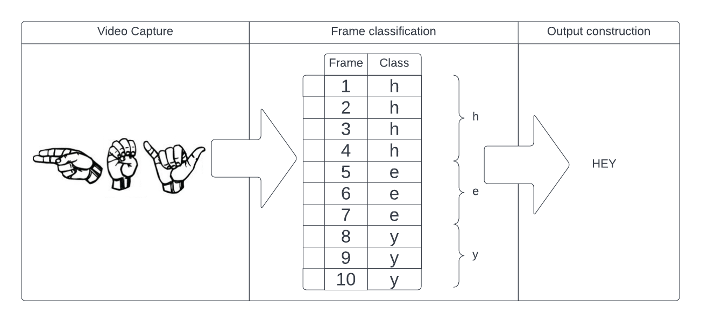

### Video Capture

The first step of the process is to capture the video of ASL being signed. There is a well documented python library called OpenCV that provides a variety of computer vision tools. Using two methods from the OpenCV library allowed us to capture a stream of video.

```python
video = cv.VideoCapture(0, cv.CAP_DSHOW)
running, original = video.read()
```

This initializes a video stream, the arguments provided specify where to capture the video from. Index 0 specifies the default device, and cv.Cap_DSHOW specifies that it is using a webcam.

video.read() returns two values, the first a boolean value indicating whether a frame has been grabbed, if it has, the frame is the second argument.

After setting up the video stream, the next step was to isolate the hands from the image to then use as input for the neural network. Because the focus of the project is classifying hand signals, an existing library was used to locate hands in the video stream rather than implementing a custom solution from the ground up.

```python
for index, info in enumerate(current.multi_handedness):
            which = info.classification[0].label
            hand_classifier.append(which)
        for index, hand in enumerate(current.multi_hand_landmarks):
            # values from 0 to 1 converted into values corresponding to video size
            hand_list = []
            for individual in hand.landmark:
                hand_list.append((int(individual.x * width ), 
                                  int(individual.y * height),
                                  int(individual.z * width )))
            # developing bounding box coordinates
            x_values = np.array(hand_list)[:, 0]
            y_values = np.array(hand_list)[:, 1]
            x_min = int(np.min(x_values) - 10)
            y_min = int(np.min(y_values) - 10)
            x_max = int(np.max(x_values) + 10)
            y_max = int(np.max(y_values) + 10)
            center = (x_min + (x_max - x_min)//2,
                      y_min + (y_max - y_min)//2)
            rect_list.append(
                     ((x_min, y_min),
                      (x_max, y_max),
                      (0, 255, 0), hand_classifier[index]))   
```

&nbsp;&nbsp;&nbsp;&nbsp;The framework selected for implementation was Mediapipe. Mediapipe Hands is a pre-trained machine learning algorithm which allows for the processing of images to isolate individual hands. Once the algorithm detects what it thinks is a hand, its coordinates are saved as a landmark. From there, the data can be converted into integer values that can be saved to a list corresponding to each individual hand it detects. The function was implemented to recognize all hands in the frame and store them in an array. Because only one hand will be taken into consideration for the transcriber, if the list of hands is longer than one, the user is prompted to remove one hand from the frame. After identifying the hand, a 150px by 150px box is drawn around it, this box is then cropped and added to an array of frames to clasify.

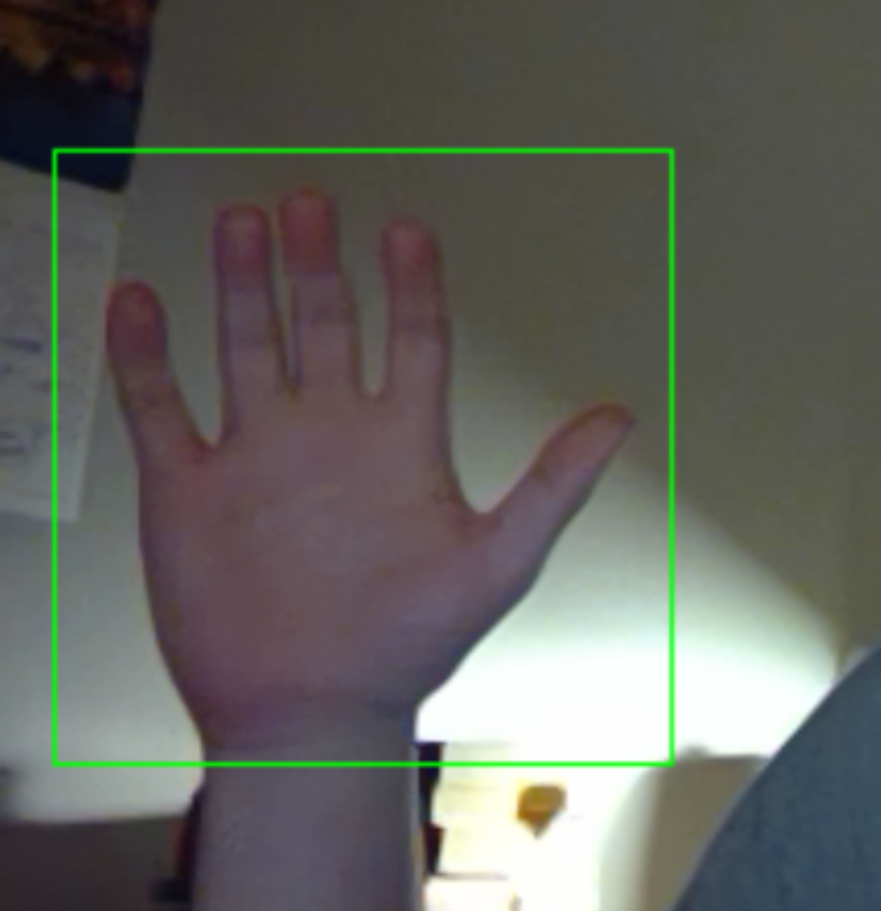

&nbsp;&nbsp;&nbsp;&nbsp;Initially, a dynamically sized bounding box was drawn around the hand, the area inside the box was cropped, then resized to 150px by 150px. This resulted in stretching on the image caused the classifier to be less accurate. After recognizing this problem, the code was changed to draw a statically sized box which was then cropped and passed directly as input to the neural network. To ensure that the hand fits within the 150px by 150px box, a bounding box is still drawn around the hand, and in the event that the bounding box intersects with the 150px by 150px box, the frame is not recorded, and the a warning is. printed to the console asking the user to move their hand back.

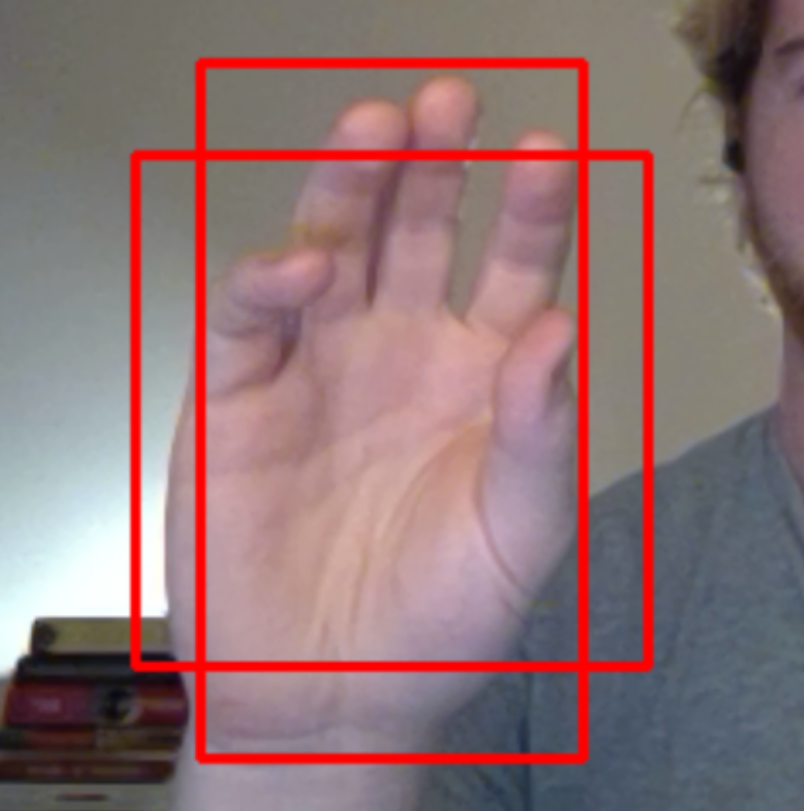
### Frame Classification

&nbsp;&nbsp;&nbsp;&nbsp;To identify the sign in each frame, the array of cropped hands is then passed to a the CNN for prediction. Two CNNs were used, one was able to classify test data at an accuracy of ~75 percent, however this model was likely overfit, as it performed poorly on video input. Cinsequently, a second model was built that featured two dropout layers, this model performed less accurately on the test data, however was more accurate for classifying video input. The classification reports for each of these models is listed in the results section.

|Model 1|Model 2|
|---|---|
|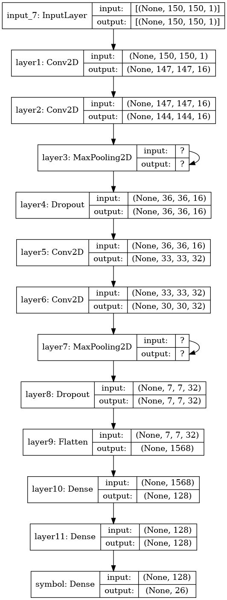|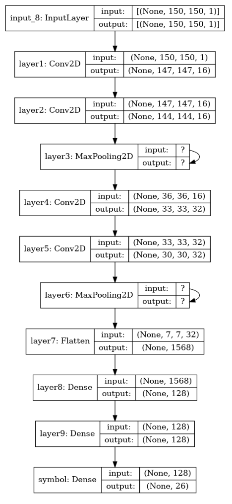|

&nbsp;&nbsp;&nbsp;&nbsp;The training data for the CNN was generated by recording each member of our group performing the ASL hand sign for approximately 20 seconds. Ths frames were then cropped around the hand and exported the the training data folder in a subdirectory named for its symbol. Initially the training data was generated by one group member, however it was then discovered that as a result of this, the model was unable to accurately classify darker skin tones, so more training data was added.

&nbsp;&nbsp;&nbsp;&nbsp;The keras adam optimizer was used alongside the categorical cross entropy loss function, the loss weight was initilized at 0.01. The metrics monitored in each epoch were accuracy and top 5 categorical accuracy (how frequently the correct class is in the top 5 predictions). The model was trained in 100 epochs with early stopping an early stopping callback  that is triggered if accuracy doesn’t increase for 8 consecutive generations and the batch size was 16. The per epoch accuracy of each model tested during hyperparamater run is shown below (it should be noted that this graph models training accuracy, which is higher than test accuracy.)

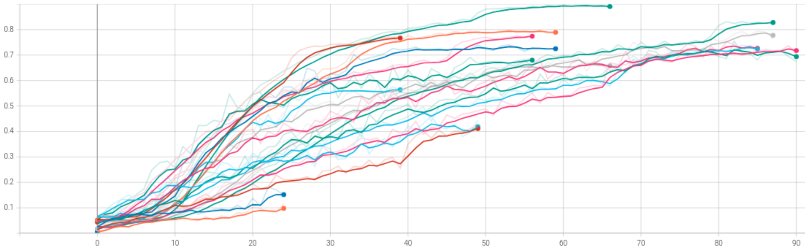

### Output construction

&nbsp;&nbsp;&nbsp;&nbsp;Following the training of the Convolutional Neural Network, the video is captured, and each frame, cropped around the hand, is stored in an array. These frames are then converted to a numpy array and passed into the classifier. The output of the classifier for each frame is added to a string, this is not the final output however, as many frames may be used to sign a single letter.  In a test case where the name “Logan” was signed, this string was built as follows: 
“lllllllllllllllllllllllllllllccooooooooooooooooooooooooooooooooooooooaaooqqcccgpggggggggqgqgggggg1gggggggggggggggggggcqaannnsassasaassssasaaaaaaaaaaaaaaaaaaaaaaaaaaaaaaaaaaaaaaaaaaaaaaaannnnnmnnnnnnnnnnnnnnnnnnnnnnnnnnnnnnnnnnnnnnnnnnnneee” 
Here it is clear to see that each of the letters L-O-G-A-N are  present in the output, but it is also littered with single frames that have been miss classified, and the number of frames per sign is not consistent. To translate this garbled mess of an output into something readable, an algorithm is applied to the string as follows:

```python
strengths = [(output[0],1)]
for i in range(1, len(output)):
  if output[i] == output[i-1]:
    strengths[-1] = (strengths[-1][0],strengths[-1][1]+1)
  else:
    strengths.append((output[i],1))
```

&nbsp;&nbsp;&nbsp;&nbsp;This results in a list of tuples each containing a character and the number of times it is classified consecutively. Graphing the strength of each character (figure 8) provides a very useful visual for understanding where the intentional signs are compared to missclassifications. The red horizontal line represents the minimum threshold of 12, meaning that a sign must be present for 12 consecutive frames to be included in the output. Here in the graph one can observe the 5 peaks, one for each of the letters in the test word. The output of the above input is thus “LOGAN” using each of the letters with strength values > 12. Next, this list of tuples is iterated over, and any letter with a strength value greater than the threshold is appended to the barrier.

```python
for letter in strengths:
  if letter[1] >= barrier:
    if len(final) > 0:
      if letter[0] != final[-1]:
        final += letter[0]
    else:
      final += letter[0]
```

Thus after applying the above code snippets, the final string output is “logan”.

## Performance

&nbsp;&nbsp;&nbsp;&nbsp;As mentioned previously, after finetuning hyperparamaters, two models were produced, one that maximized accuracy according to the classification report, and another that performed poorer on the training images, but operated better when classifying frames from the video feed, the classification reports of these models are listed below.

|Letter|Precision|Recall|F1-score|Precision|Recall|F1-score|
|------|---------|------|--------|---------|------|--------|
|a|0.78|0.9|0.84|0.27|0.7|0.39|
|b|1.0|0.75|0.86|1.0|0.45|0.62|
|c|0.73|0.95|0.83|0.94|0.8|0.86|
|d|1.0|0.55|0.71|0.86|0.60|0.71|
|e|0.82|0.45|0.58|0.88|0.35|0.50|
|f|0.93|0.65|0.76|0.94|0.80|0.86|
|g|1.0|0.85|0.92|1.0|0.85|0.92|
|h|0.83|0.75|0.79|0.9|0.95|0.93|
|i|0.93|0.65|0.76|1.0|0.35|0.52|
|j|0.75|0.45|0.56|0.56|0.45|0.50|
|k|0.76|0.95|0.84|0.75|0.60|0.67|
|l|0.75|0.9|0.82|0.49|0.95|0.64|
|m|0.77|0.5|0.61|0.55|0.60|0.57|
|n|0.50|0.5|0.50|0.57|0.20|0.3|
|o|1.0|0.75|0.86|0.93|0.65|0.76|
|p|0.78|0.9|0.84|0.95|0.9|0.92|
|q|0.94|0.85|0.89|0.94|0.8|0.86|
|r|0.68|0.65|0.67|0.71|0.5|0.59|
|s|0.36|0.8|0.50|0.38|1.0|0.55|
|t|0.57|0.85|0.68|0.39|0.8|0.52|
|u|1.00|0.6|0.75|0.75|0.45|0.56|
|v|0.84|0.8|0.82|0.65|0.65|0.65|
|w|0.93|0.65|0.76|1.0|0.85|0.92|
|x|0.82|0.9|0.86|0.8|0.8|0.8|
|y|0.72|0.9|0.8|0.92|0.6|0.73|
|z|0.47|0.85|0.61|0.72|0.65|0.68|
|Accuracy| | | 0.74| | | 0.67|
|Macro Avg|0.8|0.74|0.75|0.76|0.67|0.67|
|Weighted Avg|0.8|0.74|0.75|0.76|0.67|0.67|

### Test Cases

|Signed Word|Strength diagram|Output|Letters falsely identified|Letters not identified|
|-----------|----------------|------|--------------------------|----------------------|
|Logan|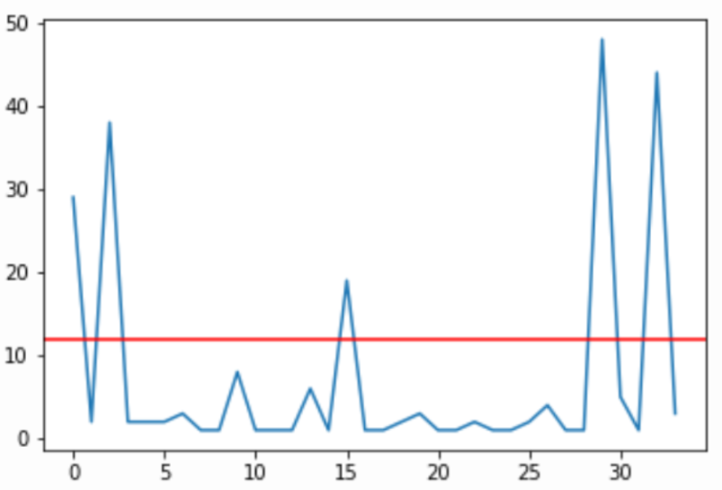|Logan|0|0|
|Gabe|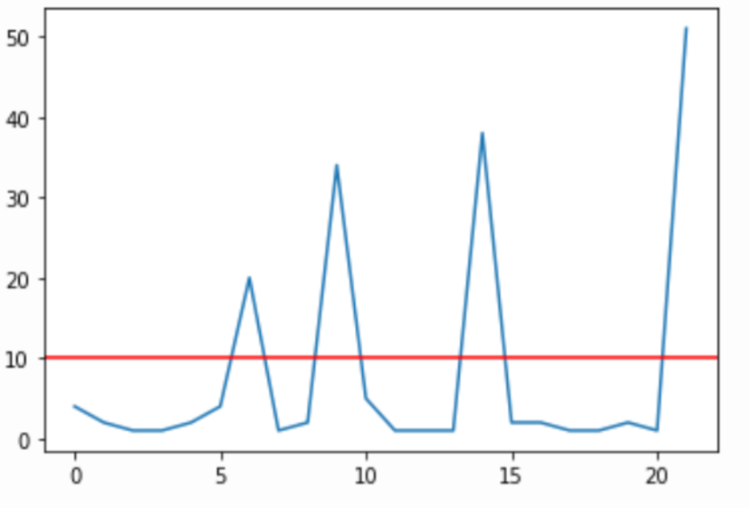|Gabm|1(m)|1(e)|
|Amani|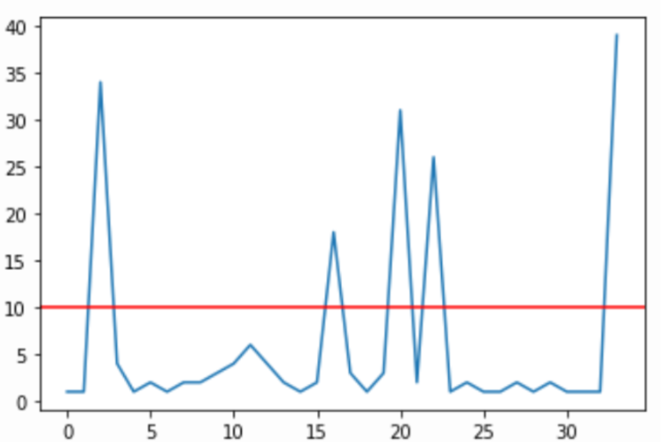|Amasi|1(s)|1(n)|
|January|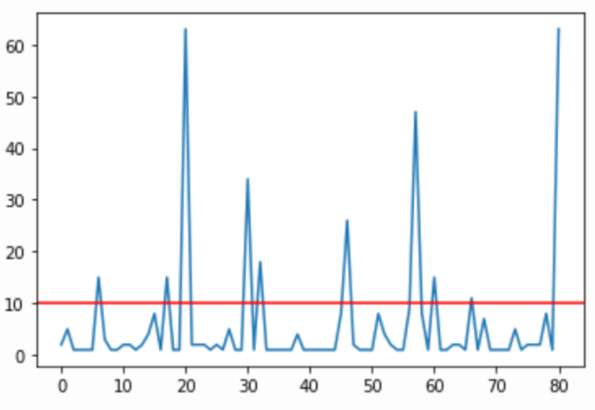|Jauaryc|1(c)|1(n)|
|While|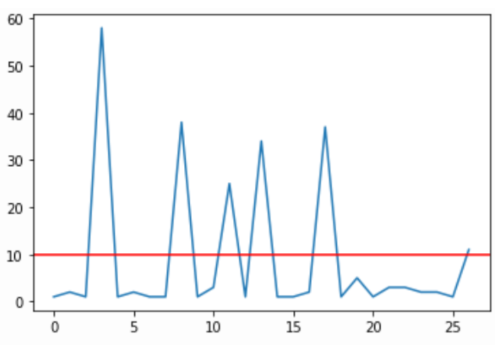|whilm|1(m)|1(e)|
|Away|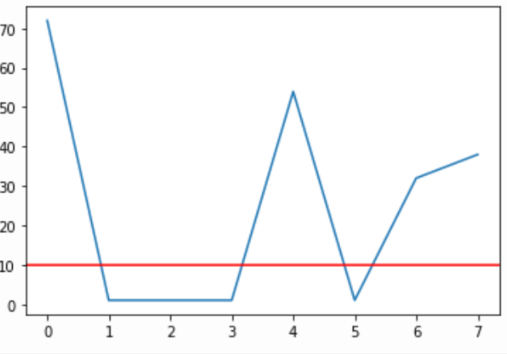|Away|0|0|
|Zebra|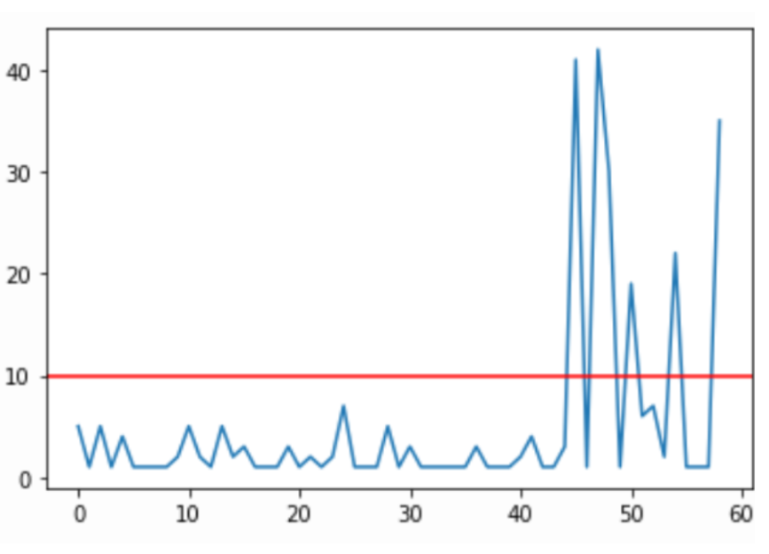|mbra|1(m)|2(z,e)|
|abcdefghijklmnopqrstuvwxyz|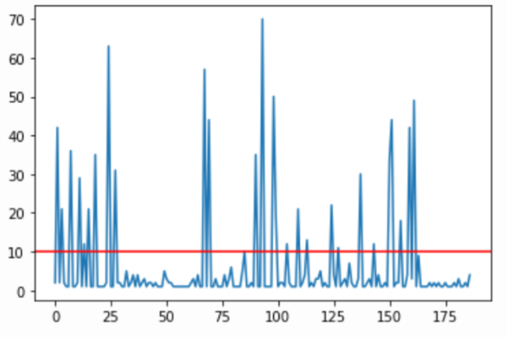|abcdmfhivlosopqprstuvwxy|e, g, j, k, m, n|m, s, z|
## Discussion

&nbsp;&nbsp;&nbsp;&nbsp;Overall, we are very happy with the results we were able to produce, while there are certainly areas that could be improved upon, the results demonstrate a proof of concept. The neural network performed satisfacotrially, however, its performance is not uniform across all symbols. As evidenced by the classification reports, symbols that are visually similar, such as m, n, and s are far more frequently misclassified when compared to more unique symbols such as y or w. While the original intention of assessing the “strength” of each sign was to ignore frames in which the signer’s hand was in motion, it has the additional benefit of optimizing the performance of the neural network when used to classify video.  This is because in addition to dropping frames with blurred hand signals, if the classifier misclassifies, as long as it has reasonable consistent performance, it is unlikely to misclassify a sign as the same incorrect value for multiple frames, meaning that misclassifications will also frequently be ignored. Another area where the classifier struggled was for j and z, both of which involve some degree of movement. When capturing the test data, the participant demonstrated the motion while the frames were being captured. This produced acceptable results, however because the range of motion these symbols can be signed with is large (moving finger alone vs moving whole hand, different levels of motion pronouncement) they were frequently misclassified.

## Conclusion
&nbsp;&nbsp;&nbsp;&nbsp;In conclusion, while our transcriber is not perfect,  we accomplished most of what we initially set out to build. We encountered some difficulties throughout the implementation process that if addressed in a future version of the project would likely result in better outcomes. The first hurdle was the lack of computing power, while finetuning the hyperparamaters for the image classifier, some training sessions would take several hours to train, meaning we could not experiment as thoroughly as we may have liked otherwise. Another issue we encountered was with processing words with double letters. The way our model works is that it analyses frames and based on the letter predicted from successive frames, the letter that shows up the most in those successive frames is chosen. This makes it hard for words with double letters as the letters will be interpreted as one letter that happened to show up in many frames. The last major issue was that of background imagery obstructing classification. We did attempt to remedy this through mask segmentation, however this caused the classifier to malfunction in all but the most opportune lighting conditions, as a result, we opted to use a black background while performing the signs.
&nbsp;&nbsp;&nbsp;&nbsp;Overall, we may conclude that the Convolutional Neural Network performed well in classifying sign language symbol images. The model's best accuracy score is well over 70%, and it may be improved even further by tweaking the hyperparameters and adding more training data.
